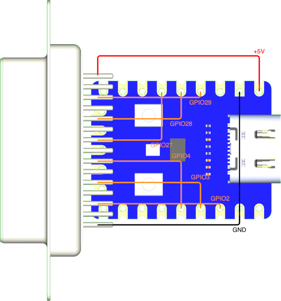
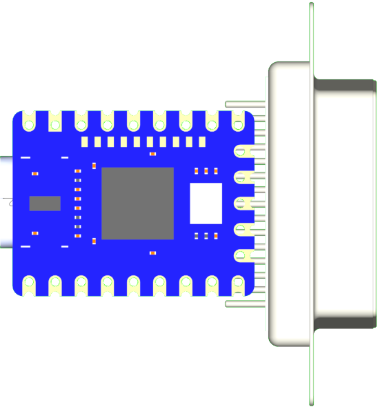

# usb2neogeo

USB/BT controllers to Neo Geo / SuperGun.

## Overview

Connects USB and Bluetooth controllers to Neo Geo consoles (AES/MVS) and SuperGun arcade boards via GPIO-based active-low output to a DB15 connector. Supports 7 button mapping profiles optimized for different arcade stick layouts and pad configurations. Uses open-drain logic to safely interface 3.3V GPIO with 5V Neo Geo hardware.

## Input

- [USB HID](../input/usb-hid.md), [XInput](../input/xinput.md), [Bluetooth](../input/bluetooth.md) controllers

## Output

[Neo Geo Output](../output/neogeo.md) -- Active-low GPIO via DB15 connector.

## Core Configuration

| Setting | Value |
|---------|-------|
| Routing mode | SIMPLE (1:1) |
| Player slots | 1 (shift on disconnect) |
| Max USB devices | 1 |
| Profile system | 7 profiles, saved to flash |

## Profiles

Hold **Select** for 2 seconds, then press **D-Pad Up/Down** to cycle.

| Profile | Description |
|---------|-------------|
| **Default** | Standard 1L6B layout |
| **Type A** | 1L6B aligned to right side of 1L8B stick |
| **Type B** | Neo Geo MVS 1L4B layout |
| **Type C** | Neo Geo MVS Big Red layout |
| **Type D** | Neo Geo MVS U4 layout |
| **Pad A** | AES pad, classic diamond (A/B/C/D on face buttons) |
| **Pad B** | AES pad, KOF/fighting style |

### Default Profile

Standard arcade mapping for 1L6B in 1L8B fightsticks:

| USB Input | Neo Geo Output |
|-----------|----------------|
| B1 (Cross/A) | B4 / K1 / D |
| B2 (Circle/B) | B5 / K2 / Select |
| B3 (Square/X) | B1 / P1 / A |
| B4 (Triangle/Y) | B2 / P2 / B |
| L1 (LB/L) | (disabled) |
| R1 (RB/R) | B3 / P3 / C |
| L2 (LT/ZL) | (disabled) |
| R2 (RT/ZR) | B6 / K3 |
| S1 (Select) | Coin |
| S2 (Start) | Start |
| D-Pad | D-Pad |
| Left Stick | D-Pad |


### Type A Profile

1L6B aligned to right side of 1L8B fightsticks:

| USB Input | Neo Geo Output |
|-----------|----------------|
| B1 (Cross/A) | (disabled) |
| B2 (Circle/B) | B4 / K1 / D |
| B3 (Square/X) | (disabled) |
| B4 (Triangle/Y) | B1 / P1 / A |
| L1 (LB/L) | B3 / P3 / C |
| R1 (RB/R) | B2 / P2 / B |
| L2 (LT/ZL) | B6 / K3 |
| R2 (RT/ZR) | B5 / K2 / Select |


### Type B Profile

Neo Geo MVS 1L4B layout:

| USB Input | Neo Geo Output |
|-----------|----------------|
| B1 (Cross/A) | B1 / P1 / A |
| B2 (Circle/B) | B5 / K2 / Select |
| B3 (Square/X) | B2 / P2 / B |
| B4 (Triangle/Y) | B3 / P3 / C |
| L1 (LB/L) | (disabled) |
| R1 (RB/R) | B4 / K1 / D |
| L2 (LT/ZL) | (disabled) |
| R2 (RT/ZR) | B6 / K3 |


### Type C Profile

Neo Geo MVS Big Red layout:

| USB Input | Neo Geo Output |
|-----------|----------------|
| B1 (Cross/A) | B1 / P1 / A |
| B2 (Circle/B) | B5 / K2 / Select |
| B3 (Square/X) | (disabled) |
| B4 (Triangle/Y) | B2 / P2 / B |
| L1 (LB/L) | B4 / K1 / D |
| R1 (RB/R) | B3 / P3 / C |
| L2 (LT/ZL) | (disabled) |
| R2 (RT/ZR) | B6 / K3 |


### Type D Profile

Neo Geo MVS U4 layout:

| USB Input | Neo Geo Output |
|-----------|----------------|
| B1 (Cross/A) | B5 / K2 / Select |
| B2 (Circle/B) | B6 / K3 |
| B3 (Square/X) | B1 / P1 / A |
| B4 (Triangle/Y) | B2 / P2 / B |
| L1 (LB/L) | B4 / K1 / D |
| R1 (RB/R) | B3 / P3 / C |
| L2 (LT/ZL) | (disabled) |
| R2 (RT/ZR) | (disabled) |


### Pad A Profile

AES pad, classic diamond (A/B/C/D on face buttons):

| USB Input | Neo Geo Output |
|-----------|----------------|
| B1 (Cross/A) | B1 / P1 / A |
| B2 (Circle/B) | B2 / P2 / B |
| B3 (Square/X) | B3 / P3 / C |
| B4 (Triangle/Y) | B4 / K1 / D |
| L1 (LB/L) | B6 / K3 |
| R1 (RB/R) | B5 / K2 / Select |
| L2 (LT/ZL) | (disabled) |
| R2 (RT/ZR) | (disabled) |


### Pad B Profile

AES pad, KOF/fighting style:

| USB Input | Neo Geo Output |
|-----------|----------------|
| B1 (Cross/A) | B2 / P2 / B |
| B2 (Circle/B) | B4 / K1 / D |
| B3 (Square/X) | B1 / P1 / A |
| B4 (Triangle/Y) | B3 / P3 / C |
| L1 (LB/L) | B6 / K3 |
| R1 (RB/R) | B5 / K2 / Select |
| L2 (LT/ZL) | (disabled) |
| R2 (RT/ZR) | (disabled) |


## Runtime Button Mapping

In addition to the 7 compiled profiles above, buttons can be remapped on fly. The runtime mapping overlays the active profile and persists until cleared.

**Mappable input buttons:** 

B1 B2 B3 B4 L1 R1 L2 R2 L3 R3 L4 R4

**Mappable output buttons:**

| Slot | Neo Geo |
|------|---------|
| 1 | B1 / P1 / A |
| 2 | B2 / P2 / B |
| 3 | B3 / P3 / C |
| 4 | B4 / K1 / D |
| 5 | B5 / K2 / Select |
| 6 | B6 / K3 |

> SELECT (Coin) and START are not mappable — they are the trigger/cancel buttons for all three modes.

### Consecutive Remap Mode

1. Hold **SELECT** alone for **2 seconds**
2. Press the button you want for **B1/A** — LED flashes twice, buttons stop registering
3. Press the button you want for **B2/B**, then **B3/C**, **B4/D**, **B5/K2**, **B6/K3**
4. After the 6th button the mapping saves automatically (LED flashes twice)
5. Press **START** at any point to cancel and clear

Already-assigned buttons are ignored — each input button can only map to one output.

### Alternative Remap Mode (Press Mode)

1. Hold **SELECT + any 2 mappable buttons** for **2 seconds** — LED flashes twice, buttons stop registering
2. Press a button N times to assign it to Neo Geo slot N (1 press → B1/A, 2 press → B2/B, …, 6 press → B6/K3)
3. 800ms silence commits the press sequence (LED blinks once per commit)
4. Press **SELECT** alone to save (LED flashes twice)
5. Press **START** alone to cancel and clear

Multiple input buttons can be assigned to the same Neo Geo outpu by pressing each the same number of times. Useful for shmups — e.g. press two buttons once each so both map to B1/A, then assign auto-fire only to one of them via Auto Fire Mode.

> **Note:** Entering this mode erases the previous runtime layout entirely.

### Auto Fire Mode

1. Hold **SELECT + exactly 1 mappable button** for **2 seconds** — LED flashes twice, buttons stop registering
2. Press the target button N times to assign a turbo frequency:

| Press | Frequency |
|------|-----------|
| 1 | 30 Hz |
| 2 | 20 Hz |
| 3 | 15 Hz |
| 4 | 12 Hz |
| 5 | 10 Hz |
| 6 | 7.5 Hz |
| 7+ | Disabled |

3. 800ms silence commits the frequency (LED blinks once)
4. Press **SELECT** alone to save (LED flashes twice)
5. Press **START** alone to discard and exit

Auto fire overlays the current button mapping without erasing it.

### Clearing the Runtime Mapping

From idle: hold **SELECT** for **2 seconds**, then press **START**. The runtime mapping is erased and the active profile resumes (LED flashes twice).

## Supported Boards

| Board | Build Command |
|-------|---------------|
| KB2040 | `make usb2neogeo_kb2040` |
| Pico | `make usb2neogeo_pico` |
| RP2040-Zero | `make usb2neogeo_rp2040zero` |

## Build and Flash

```bash
make usb2neogeo_kb2040
make flash-usb2neogeo_kb2040
```

## Wiring

### KB2040 / Pico / RP2040-Zero

| KB2040 | Pico | RP2040-Zero | DB15 Pin | Neo Geo Function |
|--------|------|-------------|----------|------------------|
| GND | GND | GND | Pin 1 | Ground |
| GPIO 7 | GPIO 7 | GPIO 2 | Pin 2 | Button 6 / K3 |
| GPIO 6 | GPIO 6 | GPIO 3 | Pin 3 | S1 (Coin) |
| GPIO 5 | GPIO 5 | GPIO 4 | Pin 4 | Button 4 / D |
| GPIO 4 | GPIO 4 | GPIO 27 | Pin 5 | Button 2 / B |
| GPIO 3 | GPIO 3 | GPIO 28 | Pin 6 | Right |
| GPIO 2 | GPIO 2 | GPIO 29 | Pin 7 | Down |
| 5V | 5V | 5V | Pin 8 | +5V Power |
| N/C | N/C | N/C | Pin 9 | - |
| GPIO 20 | GPIO 20 | GPIO 9 | Pin 10 | Button 5 / Select |
| GPIO 18 | GPIO 18 | GPIO 10 | Pin 11 | S2 (Start) |
| GPIO 26 | GPIO 26 | GPIO 11 | Pin 12 | Button 3 / C |
| GPIO 27 | GPIO 27 | GPIO 12 | Pin 13 | Button 1 / A |
| GPIO 28 | GPIO 28 | GPIO 13 | Pin 14 | Left |
| GPIO 29 | **GPIO 19** | GPIO 14 | Pin 15 | Up |

### Voltage Protection

This implementation uses open-drain logic to prevent voltage collisions between 5V and 3.3V, ensuring the safety of your Neo Geo or arcade PCBs.

- **Basic protection:** Add a 1N4148 diode with the cathode (stripe) facing the RP2040.
- **Maximum safety:** Use level shifters such as the TXS0108E (bidirectional) or the 74LVC245A (unidirectional).

### RP2040-Zero Direct Solder




### Latency Testing

Input latency is tested using the  [MiSTer FPGA Input Latency](https://github.com/misteraddons/inputlatency) methodology, but adapted for usb2neogeo use. While the original methodology measures input lag from USB gamepads on a MiSTer FPGA, this setup replaces the MiSTer with the adapter itself.

The process uses an Arduino script that triggers an input on the gamepad via PIN 5. In the original MiSTer setup, the core catches the input and sends a response back to the Arduino via the User Port to PIN 2, triggering an interrupt to calculate the elapsed time.

With this usb2neogeo, the MiSTer is not required. The adapter receives the USB gamepad inputs and routes them directly to the NEOGEO port. This output is then used as the interrupt signal for the Arduino to measure the precise delay between the physical button "press" and the adapter's output.


### Test Results
*Note: Outliers filtered using 0.02 lower and 0.995 upper quantiles to ensure statistical accuracy.*

| Setup (Input > Output) | Min (ms) | Avg (ms) | Max (ms) | Std Dev |
| :--- | :---: | :---: | :---: | :---: |
| **GP2040 (PS3)** > joypad-usb2neogeo | 0.24 | 0.74 | 1.25 | 0.28 |
| **GP2040 (PS4)** > joypad-usb2neogeo | 0.24 | 0.73 | 1.26 | 0.28 |
| **GP2040 (SW)** > joypad-usb2neogeo | 0.18 | 0.67 | 1.18 | 0.28 |
| **GP2040 (360)** > joypad-usb2neogeo | 0.18 | 0.67 | 1.19 | 0.28 |

## Troubleshooting

**Controller not detected:**
- Check Neo Geo cable connections.
- Ensure the DB15 cable is providing 5V on Pin 8 and GND on Pin 1.
- Check data pin assignments in firmware.

**Profile not saving:**
- Wait 5 seconds after changing the profile for the flash write to complete.
- Reflash firmware if flash memory appears corrupted.
